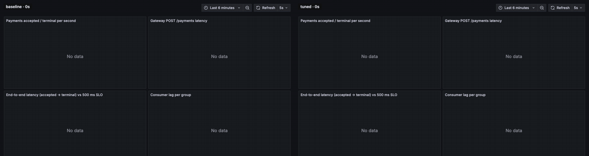
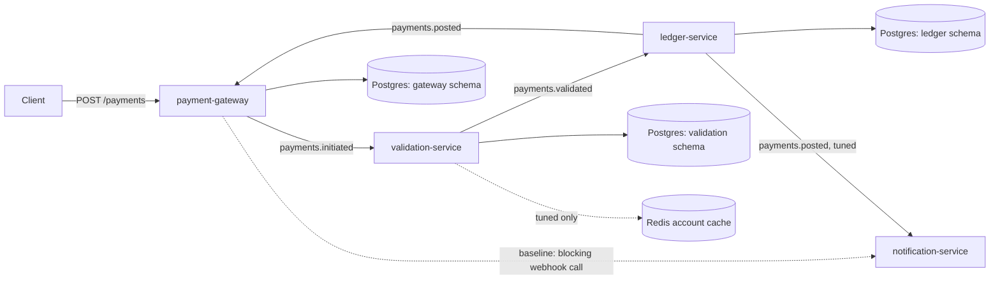

# kafka-payments-perf-lab


**A realistic Spring Boot and Kafka payment pipeline, shipped as a baseline (as commonly built) and a tuned profile, with load tests, dashboards, query-plan evidence and a sample performance audit report.** It is the public proof behind a performance-audit service: it shows how problems are found, fixed and re-measured, and what the resulting report looks like. All companies, people and data are fictional.

> Deliberately insecure for demonstration. Do not deploy. (Client identity is a trusted request header, credentials are placeholders, and the tuned profile has a token-protected lab administration endpoint. The performance flaws in the baseline are intentional too.)



*Grafana during the spike scenario (offered rate raised from 50 to 500 req/s for 60 s); baseline on the left, tuned on the right. Captured from the dashboard in this repository while the two runs stored in `2026-09-30_baseline_spike_recorded`, `2026-09-30_tuned_spike_recorded` executed (the capture adds some load, so they are not the runs used in the comparison tables). Small negative lag values are most likely an artefact of how the exporter samples offsets. Spike recovery in these recordings: baseline, recovered 91 s after the burst ended; tuned, no degradation was observed, and payments created after the burst all met the SLO.*

## Results

Generated from the committed benchmark results in `results/` (git revisions `06ce6f4`, `8862be4`, `958b37b`, Apple M5, 10 cores, load generator and services on the same machine). Objective: end-to-end p99 under 500 ms, HTTP error rate under 0.1%, no dropped iterations.

|  | Baseline | Tuned |
|---|---|---|
| Highest offered rate that met the objective (req/s) | 200 | 800 |
| First offered rate that missed it (req/s) | 400 | 1200 (offered only in an additional run) |
| End-to-end p50 at the lowest steady step (100 req/s) | 6 ms | 112 ms |
| Spike recovery, standard run | not recovered within the observed window (the recovery phase lasted 120 s); the true recovery time is unknown | no degradation was observed, and payments created after the burst all met the SLO |
| Query plan, idempotency lookup (F-06) | Seq Scan on payments, 5.52 ms | Index Scan using payments_client_key_uq on payments, 0.05 ms |
| Query plan, daily outflow (F-06) | Seq Scan on postings, 5.02 ms | Bitmap Index Scan on postings_account_created_idx, 0.37 ms |

The same offered rates against both profiles (end-to-end = payment accepted until its terminal status is recorded):

| Offered (req/s) | Baseline e2e p50 | Baseline e2e p99 | Baseline SLO | Tuned e2e p50 | Tuned e2e p99 | Tuned SLO |
|---|---|---|---|---|---|---|
| 100 | 6 ms | 208 ms | yes | 112 ms | 162 ms | yes |
| 200 | 6 ms | 308 ms | yes | 112 ms | 158 ms | yes |
| 400 | 116.1 s | 159.2 s | no | 100 ms | 157 ms | yes |
| 800 | 196.8 s | 237.4 s | no | 104 ms | 174 ms | yes |

**Read this before quoting a number.**
- Limits are known only to step resolution, so each profile has a range, not a point. The two step ranges do not overlap, so the tuned profile sustains a clearly higher load, but the step lists are coarse, so no single "times faster" figure is given.
- In `2026-09-30_tuned_steady_coldstart-800-3200` (first step 800 req/s) and `2026-09-30_tuned_steady_extended` (first step 400 req/s) the first step missed the SLO although the same offered rate met it when reached after lighter steps in another run. That is consistent with warm-up (JIT compilation, connection pools, caches); it was observed once per run and is not proven.
- The burst rate is below the highest step the tuned profile sustained in the steady runs, so the tuned system was never overloaded by the burst: this shows no degradation under the same load, not a faster recovery.
- An earlier recording of the baseline spike scenario (commit `eecb939`), made before the baseline-affecting fixes, recovered within the window; the standard recording used in the tables above did not. A further recording, taken while the dashboard was being captured (`2026-09-30_baseline_spike_recorded`), also recovered. The recordings disagree, which shows run-to-run variance in this scenario for the baseline; no cause was attributed and no single recovery time is claimed.
- The tuned profile has a higher median end-to-end latency than the baseline at low load (the smoke run and the lowest steady step). The likely causes are the outbox polling on the gateway and the ledger and producer lingering, but that was not verified. It is a real trade-off: a higher latency floor at low load in exchange for capacity at high load.
- Only the combination of all 13 changes was measured; the effect of each change alone was not isolated, and no per-stage measurements (lag, CPU, garbage collection, lock waits) were captured. See the limits section of the [sample audit report](sample-deliverable/AUDIT_REPORT_SAMPLE.md).
- Correctness held in every run: no negative balances, debits equal credits, every payment reached a terminal state (729,781 payments across 10 runs).

## Architecture



The credit-transfer flow is loosely modelled on ISO 20022 pacs.008 (simplified JSON, not a compliance implementation). Correctness holds in both profiles: idempotent `POST` (deterministic payment identifiers), exactly-once effect on the ledger (a dedup record in the same transaction as the postings), balances that never go negative, and per-debtor ordering by sequence number.

## Quickstart

Requires a JDK (21), Maven, Docker, k6 and Python.

```bash
cp .env.example .env                      # placeholder credentials for local use only
mvn verify                                # unit and Testcontainers tests, baseline profile
mvn verify -Dlab.profile=tuned -pl services/e2e-tests -am    # the same invariants, tuned profile

# benchmark a profile from a clean state (resets the stack, starts the services, runs k6, checks invariants)
./scripts/run-benchmark.sh baseline steady
./scripts/run-benchmark.sh tuned steady

# regenerate the sample reports and this README from results/
python3 scripts/generate_report.py
```

Results land in `results/<date>_<profile>_<scenario>/` (`result.json`, `summary.json`, `env.txt`, `explain.txt`). The Grafana dashboard is provisioned automatically; the services run on the host and Prometheus scrapes them.

## Features

- 4 services (gateway, validation, ledger and a notification service with a webhook simulator), on a single Kafka broker with replication factor 1 in KRaft mode, Postgres with Flyway, and Redis for the tuned cache.
- Profiles: `baseline` carries common real-world anti-patterns on purpose; `tuned` fixes each numbered finding behind its own flag, one commit per finding.
- Load scenarios in k6 (smoke, steady stepped arrival rate, spike) and a runner that resets the stack, records the environment, checks the ledger invariants and derives every figure from the database and k6 output.
- Micrometer metrics, Prometheus, Kafka and Postgres exporters and one provisioned Grafana dashboard, with per-stage metric snapshots stored beside each result.
- Distributed tracing (OpenTelemetry to Jaeger) that follows one payment across the services, through the Kafka hops and the outbox publishers. Sampling is off during benchmarks; give the services a `TRACING_SAMPLING` fraction to see traces in the Jaeger UI at `localhost:16686`.
- Query-plan evidence (`EXPLAIN (ANALYZE, BUFFERS)`) captured after every run.
- A sample audit report and a single-service quick audit, generated from the results with a lint that rejects any hand-typed number; both export to PDF (`scripts/export_pdf.js`, pandoc and headless Chrome), and `report/template/` holds the fill-in version for real client work.

The findings covered: F-01 producer batching, F-03 consumer concurrency, F-04 batch ledger writes, F-06 indexes, F-07 outbox and pool sizing, F-08 N+1 queries, F-12 record key and partitions, F-13 distributed account cache.

### Scope and known gaps

Built to the MVP cut in [SPEC.md](SPEC.md) first, then the items SPEC marks Later. Each item below is checked against the repository (files, configuration and results) when this README is generated, so it cannot claim more than exists.

**MVP scope**

| MVP item | Status | Checked in |
|---|---|---|
| Gateway, validation and ledger services | done | services/ |
| Notification handled (stub or service) | done | services/notification-service |
| Kafka broker(s) defined in compose | done | docker-compose.yml |
| Baseline anti-patterns kept behind default-off tuning flags | done | base *.yml flags |
| F-01 tuned implementation | done | gateway and ledger tuned config; async publishers |
| F-03 tuned implementation | done | consumer concurrency in *-tuned.yml |
| F-04 tuned implementation | done | BatchLedgerProcessor |
| F-06 tuned implementation | done | db/*-tuned migrations |
| F-07 tuned implementation | done | GatewayOutboxPublisher, pool sizes |
| F-08 tuned implementation | done | ProjectionReferenceData |
| F-12 tuned implementation | done | record key flag, partitions |
| F-13 tuned implementation | done | AccountCache, CachedReferenceData |
| k6 smoke, steady and spike scenarios | done | load/k6/ |
| Benchmark runner and results format | done | scripts/ |
| Prometheus and exactly one Grafana dashboard | done | monitoring/, grafana/dashboards/ |
| Results recorded for smoke, steady and spike, both profiles | done | results/ |
| Quick audit and full audit report samples | done | sample-deliverable/ |
| Tuned profile marked complete (gate in the runner) | done | payment-gateway-tuned.yml |

**Extended scope (marked Later in SPEC.md)**

| Item marked Later in SPEC.md | Status | Checked in |
|---|---|---|
| F-02 producer idempotence, acks and in-flight | done | *-baseline.yml, *-tuned.yml |
| F-05 blocking notification call replaced by a hand-off (notification-service) | done | services/notification-service |
| F-09 serialization and INFO logging | done | lab.tuning.f09 |
| F-10 JVM sizing, GC choice and virtual threads | done | lab.tuning.f10 |
| F-11 hot settlement account | done | lab.tuning.f11 |
| Three-broker Kafka cluster | done | docker-compose.yml |
| Soak scenario | done | load/k6/soak.js |
| Gatling scenarios | done | load/gatling/ |
| Distributed tracing to Jaeger | done | docker-compose.yml |
| JFR recordings and flame graphs | done | scripts/flamegraph.py |
| PDF export of the reports | done | scripts/export_pdf.js, sample-deliverable/*.pdf |
| Reusable report template folder | done | report/template/ |

Everything marked Later in SPEC.md has been built.

Known gaps in what was built: no load shedding on the gateway outbox backlog; some results predate the per-stage metric snapshots (consumer lag, CPU, garbage collection, connection pools, locks), so those runs have none stored; FX rates are cached in process rather than in Redis; connection-pool sizes are unswept lab choices; the cache accepts bounded staleness (a blocked account can be approved until its cached copy is invalidated or expires).

## Design decisions

The reasoning behind the main choices is recorded as architecture decision records:

| ADR | Decision |
|---|---|
| [ADR-0001](docs/adr/0001-exactly-once-ledger-effect.md) | Exactly-once ledger effect via a dedup record, not Kafka transactions |
| [ADR-0002](docs/adr/0002-per-debtor-ordering-with-sequence-numbers.md) | Per-debtor ordering by sequence number, independent of the partition key |
| [ADR-0003](docs/adr/0003-metrics-semantics.md) | What the dashboard metrics mean (and what they must not be used for) |
| [ADR-0004](docs/adr/0004-outbox-and-tuning.md) | Gateway outbox, and how tuned changes are gated (F-07) |
| [ADR-0005](docs/adr/0005-partition-sizing.md) | Partition count and record key (F-12) |
| [ADR-0006](docs/adr/0006-account-cache.md) | Distributed account cache (F-13) |
| [ADR-0007](docs/adr/0007-benchmark-method.md) | Benchmark method and result format |
| [ADR-0008](docs/adr/0008-notification-handling.md) | Notification handling (F-05) |
| [ADR-0009](docs/adr/0009-settlement-account.md) | Settlement account and its sharding (F-11) |
| [ADR-0010](docs/adr/0010-kafka-cluster-and-failure-behaviour.md) | Three-broker cluster and behaviour when brokers stop |
| [ADR-0011](docs/adr/0011-tracing-profiling-and-soak.md) | Tracing, profiling and soak tooling |

## Sample deliverables

- [Full audit report (sample)](sample-deliverable/AUDIT_REPORT_SAMPLE.md): executive summary, method, architecture, baseline results, findings with evidence, impact, recommendation, effort and risk, an impact against effort matrix, architecture observations, tuned against baseline, and the limits of the evidence.
- [Quick audit of one service (sample)](sample-deliverable/QUICK_AUDIT_ledger-service.md): a configuration and code review with no load test.

## Hire me

If you need an audit like this for your own Kafka and Spring Boot system: [hire me on Upwork](https://www.upwork.com/freelancers/~01c80d5fd70c92b97d?mp_source=share).
