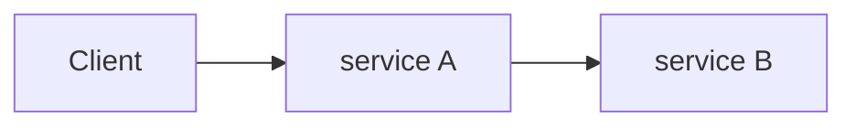
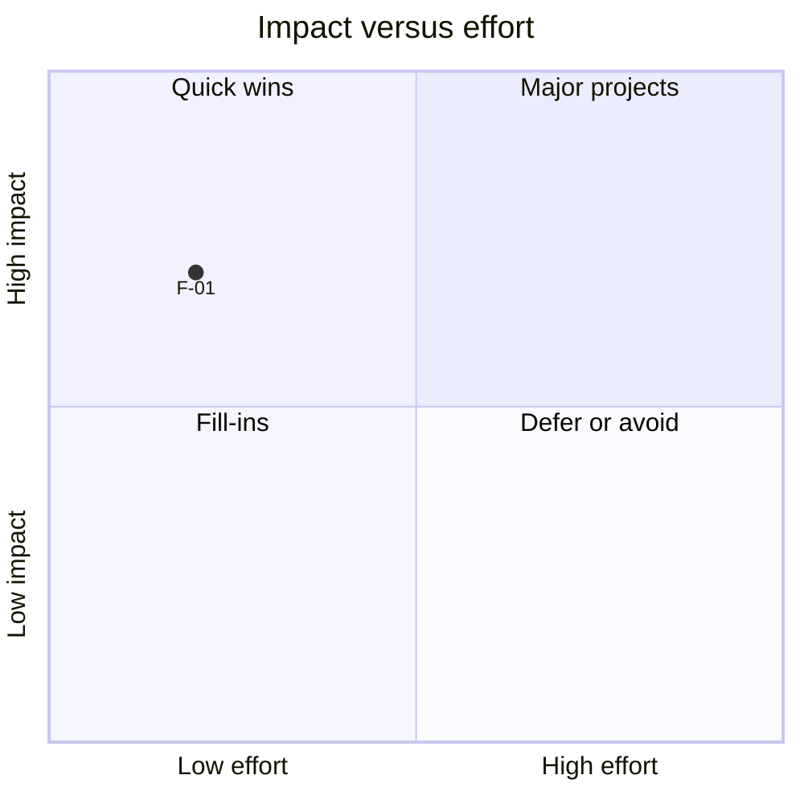

# Performance audit report: [SYSTEM NAME]

**Client:** [CLIENT NAME]. **System:** [one line: services, broker, database]. **Prepared:** [date]. **Auditor:** [name].

> Guidance: this box states provenance and the reading rule. Keep it, filled in.
> Every figure in this report comes from the attached result files (`[results folder]`) at [git revision(s) or build id].
> Read section 9 (limits of this evidence) before quoting any number.

## 1. Executive summary

> Guidance: one page. Someone who reads only this page should know the current capacity, the target, what to do first and what
> the evidence cannot say.

- **Target.** [The client's stated target, or the objective used and why.]
- **Capacity as found.** [Highest offered load that met the objective, first load that missed it (they bracket the limit),
  and the run they come from.]
- **Top fixes.** [The three changes with the best assessed value for effort, with any prerequisite each one needs.]
- **Expected gain.** [Only what was measured. If no tuned build was measured, write "not measured" and say what would measure it.]
- **What this report cannot tell you.** [The main limits of the evidence, in one or two sentences.]

## 2. Scope and method

> Guidance: enough for another engineer to repeat the measurements.

- **Environment.** [Hardware, operating system, runtimes, container limits, where the load generator ran.]
- **Objective.** [Latency percentile and threshold, error rate, recovery expectation, how end-to-end latency is measured.]
- **Workload.** [Payload mix, skew, arrival model, scenario parameters (offered rates, durations).]
- **Procedure.** [State reset between runs, warm-up, how correctness was checked after each run.]
- **Run history.** [Every discarded run and why; every re-recording and why; runs whose first step missed the objective.]

| Run | Scenario parameters | Revision | Files |
|---|---|---|---|
| [run folder] | [parameters] | [revision] | [links] |

## 3. Architecture as found

> Guidance: a diagram (Mermaid or image), the data flow in a paragraph, and the partitioning and ownership of data.

- **Data flow.** [Who calls or publishes to whom, and what is synchronous.]
- **Topics and partitions.** [Topic, partitions, record key, replication; table.]
- **Data ownership.** [Which service owns which tables or stores.]

## 4. Baseline results

> Guidance: tables generated from the result files, not retyped. State the step resolution.

| Offered load | Achieved | Request p99 | End-to-end p50 | End-to-end p99 | Dropped or failed | Objective met |
|---|---|---|---|---|---|---|
| [ ] | [ ] | [ ] | [ ] | [ ] | [ ] | [ ] |

- **Spike.** [Offered rates, and whether and when the pipeline recovered; "not recovered within the window" is a valid result.]
- **Correctness checks after every run.** [Table: invariants that must hold (money conserved, no negative balances, every
  payment terminal, duplicates absorbed) and their result per run.]

## 5. Findings

> Guidance: one block per finding, numbered `F-nn`. Evidence is something a reader can open: a metric, a query plan, a
> flame graph, a configuration line. Impact is assessed unless it was isolated by an ablation.

### F-[nn] [Short title]

- **Evidence.** [Where it is visible: file, plan, metric, graph; quote the relevant line or figure with its source.]
- **Impact.** [What it costs, and whether that was measured or assessed from the mechanism.]
- **Recommendation.** [The change, including prerequisites and what to leave alone.]
- **Effort / risk.** [S, M or L / Low, Medium or High, and the reason for the risk.]

## 6. Architecture observations

> Guidance: separate from performance findings; things that would matter even at low load.

- **Service boundaries.** [Ownership of data, duplicated attributes, coupling.]
- **Synchronous coupling.** [Which requests depend on which downstream systems being up.]
- **Retry and dead-letter strategy.** [Retries, dead-letter topics, re-drive, alerting, what a poison message does to ordering.]
- **Schema evolution.** [Versioning, tolerance to unknown fields, registry or contract tests.]
- **Delivery semantics.** [At-least-once, deduplication, ordering, what counters can and cannot be used for.]
- **Tenancy and access.** [How the caller is identified; administrative endpoints.]
- **Availability.** [Single points of failure; what was and was not tested.]

## 7. Prioritised remediation roadmap

> Guidance: an impact against effort chart, then a sequenced plan that respects dependencies. Mark scores as assessed.

| Sequence | ID | Change | Effort | Risk | Depends on |
|---|---|---|---|---|---|
| Quick wins | [ ] | [ ] | [ ] | [ ] | [ ] |
| Next sprint | [ ] | [ ] | [ ] | [ ] | [ ] |
| Structural | [ ] | [ ] | [ ] | [ ] | [ ] |

## 8. Tuned results against baseline

> Guidance: Advanced tier only. Same offered loads against both builds. Include the trade-offs (latency at low load,
> staleness, changed client contract), and any broker or dependency failure tests.

| Offered load | Baseline end-to-end p99 | Baseline objective | Tuned end-to-end p99 | Tuned objective |
|---|---|---|---|---|
| [ ] | [ ] | [ ] | [ ] | [ ] |

## 9. Limits of this evidence

> Guidance: keep every line that applies; add the client-specific ones.

- [Number of machines and runs per data point; load generator placement.]
- [Resolution of the load steps, so any ratio is a range.]
- [What was and was not isolated (combined changes versus each on its own).]
- [Which stage-level measurements were not captured, so no bottleneck is named.]
- [Disagreeing recordings and any variance that was not attributed.]

## Appendix A. Tuned configuration

[The tuned configuration as recorded with the runs (and the baseline as found), or the client's configuration as found for a Standard audit.]

## Appendix B. Raw data

[Links to every result folder and file cited.]

## Appendix C. How this report was produced

[Tools, scripts and revisions used to produce the results and the tables.]
