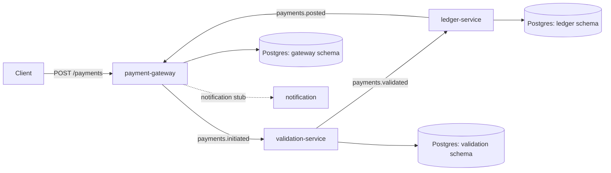
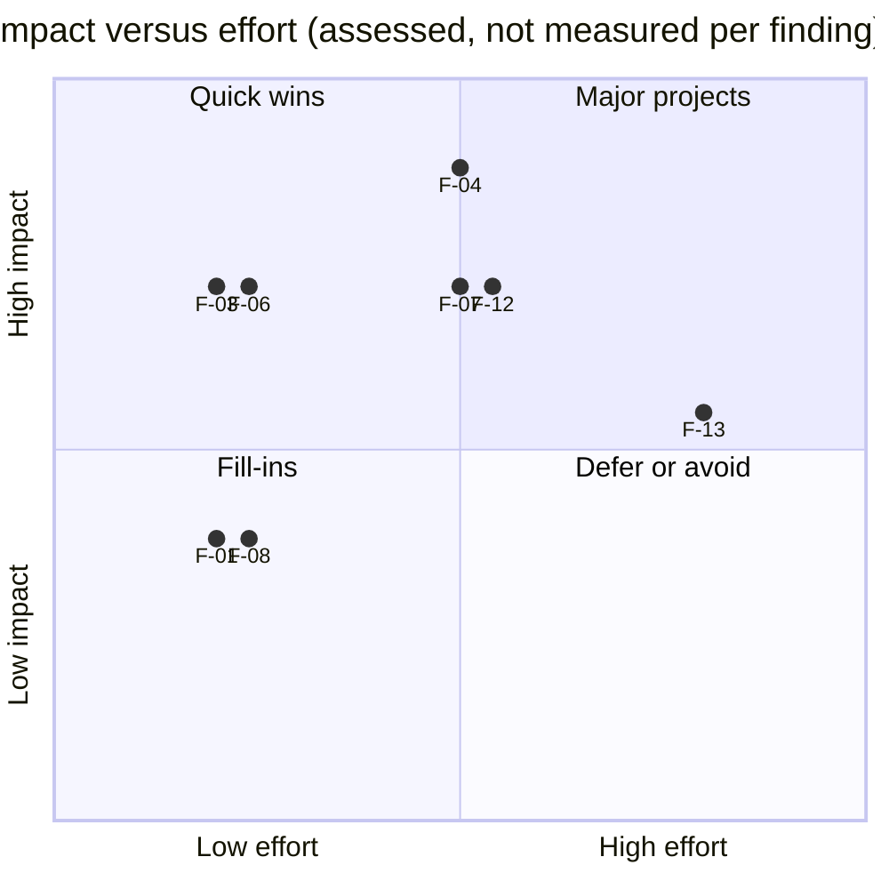

# Performance audit report (sample deliverable)

**Client:** Larkspur Pay, a fictional payments company. **System:** a credit-transfer pipeline of three Spring Boot services, Kafka and Postgres.

> This is a sample deliverable produced from the lab in this repository. The client, the system and all data are fictional. Every figure below is generated from the committed benchmark results (`results/`) at git revision(s) `06ce6f4`, `958b37b`; none is typed by hand. The report shows the method end to end: baseline, measure, diagnose, fix, re-measure, report. Read section 9 (limits of this evidence) before quoting any number.

## 1. Executive summary

**Capacity as found.** Under the stepped load scenario the baseline pipeline met the service-level objective (end-to-end p99 under 500 ms, HTTP error rate under 0.1%, no dropped iterations) at every offered rate up to 200 req/s and missed it at 400 req/s. The true limit lies between those two steps.

**After tuning.** With all eight changes applied, the tuned pipeline met the objective up to 800 req/s and missed it at 1200 req/s; again the limit lies between those steps. The two step ranges do not overlap, so the tuned profile sustains a clearly higher load, but the step lists are coarse and this report deliberately gives no single "times faster" figure.

**Spike behaviour.** The burst offered 500 req/s for 60 s on top of a base of 50 req/s. Baseline result: not recovered within the observed window (the recovery phase lasted 120 s); the true recovery time is unknown. Tuned result: no degradation was observed, and payments created after the burst all met the SLO. The burst rate is below the highest step the tuned profile sustained in the steady runs, so the tuned system was never overloaded by the burst: this shows no degradation under the same load, not a faster recovery.

**Correctness held throughout.** Across all 8 recorded runs (662,316 payments created in total), no balance went negative, debits equalled credits, and every payment reached a terminal state (section 4).

**Where to start.** Ranked by assessed impact against effort (section 7): quick wins F-03, F-06; major projects F-04, F-07, F-12. The recommended order differs slightly from the ranking because of dependencies (for example, more consumer threads only help after more partitions); section 7 gives the order.

**What this report cannot tell you.** Only the combined effect of the eight changes was measured. The contribution of each finding was not isolated, and no per-stage measurements (consumer lag, CPU, garbage collection, lock waits) were captured, so no single component is named as the bottleneck.

## 2. Scope and method

**Environment.** Apple M5, 10 cores, 16 GiB of memory, Darwin 27.0.0 arm64, openjdk version "21.0.11" 2026-04-21 LTS, k6 v2.3.0 (commit/devel, go1.27.1, darwin/arm64). Postgres, Kafka, Redis, Prometheus, Grafana and the exporters run in containers with fixed limits; the three services and the load generator run directly on the same machine, uncapped. Services and k6 run on the host and share CPU with the Docker VM; results are relative to this machine.

| Container | CPU limit | Memory limit |
|---|---|---|
| grafana | 0.50 | 512 MiB |
| kafka | 2.00 | 2048 MiB |
| kafka-exporter | 0.25 | 128 MiB |
| postgres | 2.00 | 2048 MiB |
| postgres-exporter | 0.25 | 128 MiB |
| prometheus | 0.50 | 512 MiB |
| redis | 0.50 | 256 MiB |

**Objective.** End-to-end p99 (payment accepted until its terminal status is recorded at the gateway) under 500 ms, HTTP error rate under 0.1%, no dropped load iterations, and recovery within 120 s after a spike. The recovery check uses end-to-end latency as a stand-in for consumer lag; consumer lag itself was not recorded. The payload mix is eighty percent normal payments, ten percent replays of an earlier idempotency key and ten percent that fail validation. Half of all traffic belongs to one large merchant, which is what makes the record key matter (F-12).

**Scenarios.** The step lists and durations were adjusted to the hardware, as the specification allows, and are recorded with each result:

| Run | Scenario parameters |
|---|---|
| `2026-09-30_baseline_smoke` | 10 virtual users for 60 s |
| `2026-09-30_baseline_spike` | base 50 req/s, burst 500 req/s for 60 s after 30 s, then 120 s recovery |
| `2026-09-30_baseline_steady` | steps 100, 200, 400, 800 req/s, 60 s each |
| `2026-09-30_tuned_smoke` | 10 virtual users for 60 s |
| `2026-09-30_tuned_spike` | base 50 req/s, burst 500 req/s for 60 s after 30 s, then 120 s recovery |
| `2026-09-30_tuned_steady` | steps 100, 200, 400, 800 req/s, 60 s each |
| `2026-09-30_tuned_steady_coldstart-800-3200` | steps 800, 1600, 2400, 3200 req/s, 60 s each |
| `2026-09-30_tuned_steady_extended` | steps 400, 800, 1200, 1600 req/s, 60 s each |

**Procedure.** Before every run the stack is reset (volumes dropped) and the services are restarted under the profile being measured, so each run starts from the same database and topics. After the load, the run waits for the pipeline to drain, then checks the invariants and captures query plans. End-to-end latencies come from the database (`updated_at - created_at` of the gateway row), not from the services' own counters.

**Run history, stated plainly.**
- The baseline was first recorded before the tuned profile existed. After the tuned work, three fixes that also affect baseline behaviour were made (a lock-ordering fix in the ledger, the dead-letter destination, and a read-only validation transaction). The baseline was therefore **re-recorded** at the final revision so that before and after compare identical code. The earlier recording remains in the git history.
- A first steady run was discarded because the machine went to sleep during it; the benchmark script now holds a sleep assertion.
- Two additional tuned steady runs with higher step lists are kept. In both, the first step missed the objective. In `2026-09-30_tuned_steady_coldstart-800-3200` (first step 800 req/s) and `2026-09-30_tuned_steady_extended` (first step 400 req/s) the first step missed the SLO although the same offered rate met it when reached after lighter steps in another run. That is consistent with warm-up (JIT compilation, connection pools, caches); it was observed once per run and is not proven.

## 3. Architecture as found



A client submits a payment with an idempotency key. The gateway records it, assigns a per-debtor sequence number and publishes `payments.initiated`. Validation checks schema, ownership, status, limits and a sanctions stub, and publishes `payments.validated` for every payment, rejections included. The ledger applies payments once (a dedup record written in the same transaction as the postings), in per-debtor sequence order, with double-entry postings and a balance that cannot go negative. It publishes the outcome on `payments.posted`, and the gateway updates the payment status from that event. One Postgres instance holds a schema per service; no service reads another's schema.

**Partitioning as found.** Every topic carries records keyed by merchant identifier, with these partition counts:

| Profile | payments.initiated | payments.validated | payments.posted | payments.validated.DLT |
|---|---|---|---|---|
| baseline | 3 | 3 | 3 | 3 |

## 4. Baseline results

**Steady (stepped constant arrival rate).**

| Offered (req/s) | Achieved (req/s) | POST p99 | End-to-end p50 | End-to-end p99 | Dropped iterations | SLO met |
|---|---|---|---|---|---|---|
| 100 | 100 | 11 ms | 6 ms | 208 ms | 0 | yes |
| 200 | 200 | 6 ms | 6 ms | 308 ms | 0 | yes |
| 400 | 400 | 61 ms | 116.1 s | 159.2 s | 0 | no |
| 800 | 444 | 5.8 s | 196.8 s | 237.4 s | 21381 | no |

**Spike.** 50 req/s, then 500 req/s for 60 s, then back. Recovery: not recovered within the observed window (the recovery phase lasted 120 s); the true recovery time is unknown.

**Correctness checks after every run**, baseline and tuned:

| Run | Payments created | All invariants hold | Negative balances | Debits minus credits (minor units) | Non-terminal payments | Sequence conflicts |
|---|---|---|---|---|---|---|
| `2026-09-30_baseline_smoke` | 1640 | yes | 0 | 0 | 0 | 0 |
| `2026-09-30_baseline_spike` | 33836 | yes | 0 | 0 | 0 | 0 |
| `2026-09-30_baseline_steady` | 62009 | yes | 0 | 0 | 0 | 0 |
| `2026-09-30_tuned_smoke` | 1660 | yes | 0 | 0 | 0 | 0 |
| `2026-09-30_tuned_spike` | 33808 | yes | 0 | 0 | 0 | 0 |
| `2026-09-30_tuned_steady` | 81001 | yes | 0 | 0 | 0 | 0 |
| `2026-09-30_tuned_steady_coldstart-800-3200` | 238631 | yes | 0 | 0 | 0 | 0 |
| `2026-09-30_tuned_steady_extended` | 209731 | yes | 0 | 0 | 0 | 0 |

## 5. Findings

Each finding lists the evidence available, the expected impact, a recommendation, the effort (S, M or L) and the risk of making the change. Impact is **assessed** from the mechanism and the combined measurement; it was not isolated per finding.

### F-01 Producer sends synchronously, without batching or compression

- **Evidence.** In the baseline gateway the payment is published with a blocking send inside the database transaction, with `linger.ms` at 0 and no compression (`PaymentService`, `payment-gateway-baseline.yml`). The other services rely on Kafka's producer defaults.
- **Impact.** Every request pays a broker round trip and produces small batches. On its own the effect is modest, because F-07 removes the send from the request path.
- **Recommendation.** Publish from an outbox with asynchronous sends and a callback, `linger.ms` around 10, a larger batch size (65536 bytes here) and lz4 compression. Do not linger where a consumer must wait for each acknowledgement before committing its offset (validation).
- **Effort / risk.** S / Low. Partial send failures can reorder events; the ledger orders by sequence number, so this is safe here.

### F-03 One consumer thread regardless of partition count

- **Evidence.** The baseline runs 1 consumer thread per service over 3 partitions (`*-baseline.yml`); the tuned profile runs 12. `PartitioningTest` checks the consumer-group membership in both profiles.
- **Impact.** A single thread caps each stage at one record's processing time at a time. Raising concurrency only helps if there are enough partitions (F-12) and enough database connections (F-07).
- **Recommendation.** Match consumer threads to partitions per instance, after sizing the connection pools.
- **Effort / risk.** S / Medium. Real parallelism exposes lock-ordering problems in the ledger; one was found and fixed while doing this work (a drain that took locks out of order).

### F-04 Ledger commits one record per transaction

- **Evidence.** `LedgerService.handle` opens a transaction per record and issues each statement in its own round trip (locks, dedup check, postings, balances, outbox). The tuned `BatchLedgerProcessor` applies a whole poll in one transaction with JDBC batches (250 records per poll here).
- **Impact.** Assessed highest: it multiplies statements and commits per payment on the stage that writes the most rows and takes account locks. This is a judgement from the mechanism; per-stage timings were not captured.
- **Recommendation.** Batch listener with one ordered lock set per batch, in-memory application against the locked snapshot, dedup inside and across batches, and per-record fallback for poison messages, never dead-lettering a whole batch.
- **Effort / risk.** M / High. This is the most delicate change: it must keep idempotency, sequence ordering and the balance invariant. It is covered by dedicated tests (duplicates, reordering, opposite transfers, a poison record, a database outage).

### F-06 Missing indexes

- **Evidence.** Query plans captured after the steady runs:

| Profile | Query | Plan node | Rows removed by filter | Execution time |
|---|---|---|---|---|
| baseline | idempotency lookup | Seq Scan on payments | 62008 | 5.52 ms |
| baseline | daily outflow | Seq Scan on postings | 110183 | 5.02 ms |
| tuned | idempotency lookup | Index Scan using payments_client_key_uq on payments | n/a | 0.05 ms |
| tuned | daily outflow | Bitmap Index Scan on postings_account_created_idx | n/a | 0.37 ms |

- **Impact.** The cost of both queries grows with table size, so the baseline degrades as a run (or a day) accumulates rows; the plans above were captured at different table sizes and show the mechanism, not a like-for-like timing.
- **Recommendation.** A unique index on the client and idempotency key, and an index on posting account and creation time. (The payment identifier is already a deterministic primary key; the cost removed is the scan of the key lookup.)
- **Effort / risk.** S / Low.

### F-07 Gateway waits for the broker inside a transaction; pools left at defaults

- **Evidence.** The baseline gateway holds a pooled connection, an advisory lock and the debtor's sequence row lock across the broker round trip, and all pools use the driver default. `OutboxTest` shows the contract difference: with the broker down the baseline answers 503 and stores nothing, while the tuned gateway accepts the payment and publishes it later.
- **Impact.** Under load, request threads queue for connections that are held during network waits.
- **Recommendation.** Write the payment and an outbox row in one short transaction and publish after commit; size the pools for the database (gateway 6, validation 6, ledger 8 here). Those pool sizes are unswept lab choices, not recommendations.
- **Effort / risk.** M / Medium. Clients must accept that a payment can be accepted while the broker is unavailable; load shedding on outbox backlog is recommended and was not implemented.

### F-08 Lazy per-account limit queries (N+1)

- **Evidence.** The baseline loads each account and then its limits with a separate query, including for the creditor whose limits are unused. `ReferenceDataAccessTest` asserts at least two limit-table scans per validation in the baseline and at most one when tuned (a property assertion, not a benchmark figure).
- **Impact.** Extra queries per payment; small on its own once F-13 or a cache is in place.
- **Recommendation.** One projection query joining accounts and their limit, an index on the limit table, and a short-lived in-process cache for the small, rarely changing rate table.
- **Effort / risk.** S / Low.

### F-12 Records keyed by merchant on few partitions

- **Evidence.** Baseline keys every record by merchant on the partition counts in section 3; the tuned profile keys by debtor account, with the counts of both profiles below. `PartitioningTest` checks keys and counts in both profiles. The load profile sends half of its traffic through one merchant.

| Profile | payments.initiated | payments.validated | payments.posted | payments.validated.DLT |
|---|---|---|---|---|
| baseline | 3 | 3 | 3 | 3 |
| tuned | 12 | 12 | 12 | 12 |

- **Impact.** A large merchant concentrates work on one partition and therefore one consumer thread; too few partitions also cap useful concurrency (F-03). Whether a hot partition limited the baseline was not measured (no per-partition lag was captured).
- **Recommendation.** Key by debtor account and size partitions from measured per-partition throughput against the target rate; partitions can be added later but never removed, so plan the migration. Per-debtor ordering does not depend on the key (sequence numbers), which is what makes the change safe.
- **Effort / risk.** M / Medium. A single very busy debtor becomes a hot partition.

### F-13 Account data read from Postgres on every validation

- **Evidence.** The baseline reads status, limits and ownership from Postgres for every payment. The tuned profile serves them from a Redis cache with versioned invalidation events, a time-to-live of 60 s as a backstop, single-flight loading and fail-open behaviour; `CacheTest` covers invalidation, the stale-reader race, stampede protection and a Redis outage. The cache hit ratio was **not** captured in the benchmark runs.
- **Impact.** Assessed moderate and only after F-06 and F-08 have removed the cheap wins; there is no measurement of its share of the combined result.
- **Recommendation.** Defer until the effect of the cheaper changes is measured and a hit ratio can be observed. The trade-off is staleness: a blocked account can still be approved until its cached copy is invalidated or expires. Any adoption needs an explicit staleness tolerance from the business.
- **Effort / risk.** L / High.

## 6. Architecture observations

These are separate from the performance findings: they concern how the system is put together, and would matter even at low load.

- **Service boundaries.** The split into gateway, validation and ledger follows ownership of data well: the gateway owns payment status, validation owns reference data, the ledger owns balances and postings, with one Postgres schema each. Account attributes (currency, owner) exist in both the validation and the ledger schemas with no synchronisation mechanism; in the lab both are seeded, in production they would drift.
- **Synchronous coupling.** In the baseline the availability of `POST /payments` depends on the broker, because the gateway publishes inside its request. The outbox removes that dependency at the cost of accepting payments while the pipeline is stalled; the client contract and the alerting need to reflect that.
- **Retry and dead-letter strategy.** Consumers retry a bounded number of times and then dead-letter. A dead-lettered payment leaves a gap in its debtor's sequence, and every later payment for that debtor waits behind the gap. There is no re-drive tooling and nothing consumes or alerts on the dead-letter topics. The tuned batch consumer retries transient database errors without limit and only dead-letters a record that fails on its own. Recommendation: monitor the dead-letter topics, provide a re-drive path, and define how a sequence gap is repaired.
- **Schema evolution.** Events carry a schema version and consumers ignore unknown fields, which tolerates additive change. There is no schema registry and no compatibility check, so a renamed or removed field breaks consumers at runtime. Recommendation: a registry or consumer-driven contract tests before the first breaking change.
- **Delivery semantics.** Delivery is at-least-once everywhere; correctness comes from deterministic identifiers, the ledger's dedup record and monotonic status updates. This is sound and well tested, but it means the service counters count attempts, so they must not be used for business reporting (ADR-0003).
- **Tenancy and access.** The client identity is a trusted request header, and the tuned profile adds a token-protected administration endpoint on the service port. Both are lab conveniences, not designs to copy.
- **Availability.** A single broker with replication factor one and a single database instance are lab limits; nothing here says how the pipeline behaves when either fails over.

## 7. Prioritised remediation roadmap

Impact is assessed (one to five) and effort is S, M or L; quadrants use an impact of four or more as high and effort S as small. Where the score and the recommended order disagree (F-03 scores as a quick win but only pays off after F-12 and F-07), the sequenced plan follows the dependency.



| ID | Finding | Area | Assessed impact | Effort | Risk | Quadrant |
|---|---|---|---|---|---|---|
| F-04 | Ledger commits one record per transaction with one statement per round trip | Ledger writes | 5 of 5 | M | High | Major project |
| F-03 | One consumer thread per service regardless of partition count | Kafka consumer | 4 of 5 | S | Medium | Quick win |
| F-06 | No indexes on the idempotency lookup and on the daily-outflow query | Database | 4 of 5 | S | Low | Quick win |
| F-07 | Gateway holds a connection and locks while it waits for the broker; pools left at defaults | Gateway and pools | 4 of 5 | M | Medium | Major project |
| F-12 | Records keyed by merchant on few partitions | Topic design | 4 of 5 | M | Medium | Major project |
| F-13 | Every validation reads account status, limits and rates from Postgres | Caching | 3 of 5 | L | High | Defer or avoid |
| F-01 | Producer sends one record at a time, synchronously, without batching or compression | Kafka producer | 2 of 5 | S | Low | Fill-in |
| F-08 | Validation loads limits with lazy per-account queries (N+1) | Validation reads | 2 of 5 | S | Low | Fill-in |

**Sequenced plan.** The order respects dependencies: partitions before consumer threads, indexes before the outbox that relies on them, the outbox before asynchronous publishing, the projection query before the cache.

| Sequence | ID | Change | Effort | Risk | Depends on |
|---|---|---|---|---|---|
| Quick wins | F-06 | No indexes on the idempotency lookup and on the daily-outflow query | S | Low | none |
| Quick wins | F-08 | Validation loads limits with lazy per-account queries (N+1) | S | Low | none |
| Next sprint | F-01 | Producer sends one record at a time, synchronously, without batching or compression | S | Low | F-07 |
| Next sprint | F-03 | One consumer thread per service regardless of partition count | S | Medium | F-12 |
| Next sprint | F-07 | Gateway holds a connection and locks while it waits for the broker; pools left at defaults | M | Medium | F-06 |
| Next sprint | F-12 | Records keyed by merchant on few partitions | M | Medium | none |
| Structural | F-04 | Ledger commits one record per transaction with one statement per round trip | M | High | none |
| Structural | F-13 | Every validation reads account status, limits and rates from Postgres | L | High | F-08 |

## 8. Tuned results against baseline

**Steady.** The same offered rates against both profiles:

| Offered (req/s) | Baseline e2e p50 | Baseline e2e p99 | Baseline SLO | Tuned e2e p50 | Tuned e2e p99 | Tuned SLO |
|---|---|---|---|---|---|---|
| 100 | 6 ms | 208 ms | yes | 112 ms | 162 ms | yes |
| 200 | 6 ms | 308 ms | yes | 112 ms | 158 ms | yes |
| 400 | 116.1 s | 159.2 s | no | 100 ms | 157 ms | yes |
| 800 | 196.8 s | 237.4 s | no | 104 ms | 174 ms | yes |

**Spike.**

| Phase | Offered (req/s) | Baseline e2e p50 | Baseline e2e p99 | Baseline dropped | Tuned e2e p50 | Tuned e2e p99 | Tuned dropped |
|---|---|---|---|---|---|---|---|
| warm | 50 | 8 ms | 125 ms | 0 | 112 ms | 335 ms | 0 |
| burst | 500 | 64.0 s | 106.8 s | 0 | 108 ms | 167 ms | 0 |
| recover | 50 | 60.1 s | 106.8 s | 0 | 109 ms | 152 ms | 0 |

**Smoke** (ten virtual users, correctness check):

| Profile | Payments created | End-to-end p50 | p95 | p99 | HTTP error rate | p99 under SLO |
|---|---|---|---|---|---|---|
| baseline | 1640 | 47 ms | 76 ms | 125 ms | 0.00% | yes |
| tuned | 1660 | 99 ms | 139 ms | 171 ms | 0.00% | yes |

**Reading these tables.**
- The tuned profile has a higher median end-to-end latency than the baseline at low load. The likely causes are the outbox polling on the gateway and the ledger and producer lingering, but that was not verified. It is a real trade-off: lower load, higher floor.
- Higher steps in the baseline column are dominated by queueing; the numbers there describe an overloaded pipeline, not its service time. Baseline steps are also not independent, because its cost grows as the tables fill during a run.
- Additional tuned runs with higher step lists, kept as recorded:

| Run | First step | Offered (req/s) | Achieved (req/s) | POST p99 | End-to-end p50 | End-to-end p99 | Dropped iterations | SLO met |
|---|---|---|---|---|---|---|---|---|
| `2026-09-30_tuned_steady_coldstart-800-3200` | yes | 800 | 795 | 586 ms | 118 ms | 4.1 s | 283 | no |
| `2026-09-30_tuned_steady_coldstart-800-3200` | no | 1600 | 1339 | 2.3 s | 145.2 s | 169.3 s | 15655 | no |
| `2026-09-30_tuned_steady_coldstart-800-3200` | no | 2400 | 1163 | 3.0 s | 102.7 s | 128.7 s | 74207 | no |
| `2026-09-30_tuned_steady_coldstart-800-3200` | no | 3200 | 1112 | 4.5 s | 49.8 s | 76.7 s | 125289 | no |
| `2026-09-30_tuned_steady_extended` | yes | 400 | 400 | 212 ms | 104 ms | 1.6 s | 9 | no |
| `2026-09-30_tuned_steady_extended` | no | 800 | 800 | 53 ms | 126 ms | 311 ms | 0 | yes |
| `2026-09-30_tuned_steady_extended` | no | 1200 | 1200 | 126 ms | 835 ms | 33.2 s | 0 | no |
| `2026-09-30_tuned_steady_extended` | no | 1600 | 1481 | 1.7 s | 34.1 s | 59.3 s | 7120 | no |

## 9. Limits of this evidence

- One machine, one run per data point, load generator and services sharing the host. Differences at the level of a step are meaningful; small differences are not.
- The limits are known only to step resolution, so any ratio is a range. The offered rate at which dropped iterations appear reflects latency backing up into the load generator; host contention may contribute and was not isolated.
- Only the combination of all eight changes was measured. The per-finding impact in section 7 is an informed assessment. An ablation (tuned with one change reverted) is the way to measure each one and is recommended before investing in the larger items.
- No consumer lag, CPU, garbage-collection or lock-wait data was captured, so which stage limits either profile is not established. The dashboard exists (`grafana/dashboards`) but no snapshots were stored with the results.
- An earlier recording of the baseline spike scenario, made before three baseline-affecting fixes, did recover within the window; the current one did not. The difference was not attributed to a cause and may be run-to-run variance.
- The query plans were captured after the runs at different table sizes.
- Duplicate replays create no payment, so payment counts are roughly ninety percent of request counts.

## Appendix A. Tuned configuration (verbatim from the run's environment record)

```yaml
  --- payment-gateway-tuned.yml
  lab:
    topics:
      partitions: 12
    tuning:
      complete: true   # every MVP finding (F-01, F-03, F-04, F-06, F-07, F-08, F-12, F-13) is implemented; run-benchmark.sh checks this
      f01: true
      f07: true
      f12: true
  spring:
    kafka:
      listener:
        concurrency: 12
      producer:
        compression-type: lz4
        batch-size: 65536
        properties:
          linger.ms: 10
    datasource:
      hikari:
        maximum-pool-size: 6
        connection-timeout: 2000
    flyway:
      locations: classpath:db/gateway,classpath:db/gateway-tuned
  --- validation-service-tuned.yml
  lab:
    admin:
      token: ${LAB_ADMIN_TOKEN:lab-admin-local-only}   # F-13 admin endpoint (lab only); placeholder value
    cache:
      namespace: v1      # F-13: bump to drop every cached entry (key versioning)
      ttl-seconds: 60    # F-13: backstop if an invalidation event is missed
    topics:
      partitions: 12
    tuning:
      f08: true
      f12: true
      f13: true
  spring:
    data:
      redis:
        host: ${REDIS_HOST:localhost}
        port: ${REDIS_PORT:6390}
        timeout: 100ms          # F-13: fail open quickly when Redis is slow or down
        connect-timeout: 100ms
    kafka:
      listener:
        concurrency: 12
      producer:
        compression-type: lz4
        batch-size: 65536
        properties:
          linger.ms: 0
    datasource:
      hikari:
        maximum-pool-size: 6
        connection-timeout: 5000
    flyway:
      locations: classpath:db/validation,classpath:db/validation-tuned
  management:
    health:
      redis:
        enabled: true
  --- ledger-service-tuned.yml
  lab:
    topics:
      partitions: 12
    outbox:
      poll-ms: 50       # F-04: the outbox flush no longer runs on (and serialises) the listener threads
    tuning:
      f01: true
      f04: true
      f12: true
  spring:
    kafka:
      listener:
        type: batch     # F-04
        concurrency: 12
      consumer:
        max-poll-records: 250            # F-04: batch size per poll
        properties:
          max.poll.interval.ms: 600000   # F-04: a batch may retry a database outage for a long time
      producer:
        compression-type: lz4
        batch-size: 65536
        properties:
          linger.ms: 10
    datasource:
      hikari:
        maximum-pool-size: 8
        connection-timeout: 60000
        data-source-properties:
          reWriteBatchedInserts: true   # F-04: multi-row INSERT rewriting for JDBC batches
    flyway:
      locations: classpath:db/ledger,classpath:db/ledger-tuned
```

## Appendix B. Raw data

| Run | Git sha | Files |
|---|---|---|
| `2026-09-30_baseline_smoke` | 06ce6f4 | [result.json](../results/2026-09-30_baseline_smoke/result.json) · [summary.json](../results/2026-09-30_baseline_smoke/summary.json) · [env.txt](../results/2026-09-30_baseline_smoke/env.txt) · [explain.txt](../results/2026-09-30_baseline_smoke/explain.txt) |
| `2026-09-30_baseline_spike` | 06ce6f4 | [result.json](../results/2026-09-30_baseline_spike/result.json) · [summary.json](../results/2026-09-30_baseline_spike/summary.json) · [env.txt](../results/2026-09-30_baseline_spike/env.txt) · [explain.txt](../results/2026-09-30_baseline_spike/explain.txt) |
| `2026-09-30_baseline_steady` | 06ce6f4 | [result.json](../results/2026-09-30_baseline_steady/result.json) · [summary.json](../results/2026-09-30_baseline_steady/summary.json) · [env.txt](../results/2026-09-30_baseline_steady/env.txt) · [explain.txt](../results/2026-09-30_baseline_steady/explain.txt) |
| `2026-09-30_tuned_smoke` | 06ce6f4 | [result.json](../results/2026-09-30_tuned_smoke/result.json) · [summary.json](../results/2026-09-30_tuned_smoke/summary.json) · [env.txt](../results/2026-09-30_tuned_smoke/env.txt) · [explain.txt](../results/2026-09-30_tuned_smoke/explain.txt) |
| `2026-09-30_tuned_spike` | 06ce6f4 | [result.json](../results/2026-09-30_tuned_spike/result.json) · [summary.json](../results/2026-09-30_tuned_spike/summary.json) · [env.txt](../results/2026-09-30_tuned_spike/env.txt) · [explain.txt](../results/2026-09-30_tuned_spike/explain.txt) |
| `2026-09-30_tuned_steady` | 06ce6f4 | [result.json](../results/2026-09-30_tuned_steady/result.json) · [summary.json](../results/2026-09-30_tuned_steady/summary.json) · [env.txt](../results/2026-09-30_tuned_steady/env.txt) · [explain.txt](../results/2026-09-30_tuned_steady/explain.txt) |
| `2026-09-30_tuned_steady_coldstart-800-3200` | 958b37b | [result.json](../results/2026-09-30_tuned_steady_coldstart-800-3200/result.json) · [summary.json](../results/2026-09-30_tuned_steady_coldstart-800-3200/summary.json) · [env.txt](../results/2026-09-30_tuned_steady_coldstart-800-3200/env.txt) · [explain.txt](../results/2026-09-30_tuned_steady_coldstart-800-3200/explain.txt) |
| `2026-09-30_tuned_steady_extended` | 958b37b | [result.json](../results/2026-09-30_tuned_steady_extended/result.json) · [summary.json](../results/2026-09-30_tuned_steady_extended/summary.json) · [env.txt](../results/2026-09-30_tuned_steady_extended/env.txt) · [explain.txt](../results/2026-09-30_tuned_steady_extended/explain.txt) |

## Appendix C. How this report was produced

`scripts/run-benchmark.sh` produced each result folder; `scripts/collect_results.py` derived `result.json`; `scripts/generate_report.py` filled this document from those files and the service configuration. `scripts/lint_report_numbers.py` rejects any number in the template prose that is not a generated placeholder, and CI fails if this file differs from a fresh generation.
